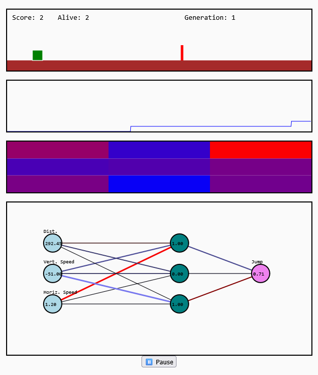

# 🦖 Robo Dino

A neuroevolution sandbox built with **Rust**, **WebAssembly**, and **TypeScript**, where pixel dinosaurs learn to survive by jumping over obstacles. This simulation runs entirely in the browser and showcases how simple neural networks, mutation, and selection pressure can lead to emergent intelligence — one generation at a time.



## 🚀 Live Demo

👉 [Try it now on GitHub Pages](https://fulgidus.github.io/robo-dino)

## 🎯 Features

- Evolutionary AI powered by simple neural networks
- Hidden layer support with customizable neuron count
- Real-time visualization of neural activations and weights
- Fitness history graph and weight heatmap
- Swarm simulation of hundreds of dinos
- Fully browser-based with zero dependencies or backend
- Written from scratch in Rust with WebAssembly bindings

## 🛠️ Tech Stack

- 🦀 Rust for simulation logic and evolution
- 🕸 WebAssembly for performance in the browser
- 💻 TypeScript + HTML5 Canvas for UI and visualization
- 📦 Built and bundled with `wasm-pack` and `vite`

## 📦 Getting Started

### 1. Build the Rust → WebAssembly module
```sh
cd rust-dino
wasm-pack build --target web --out-dir ../frontend/src/rust
```

### 2. Run the frontend locally
```sh
cd ../frontend
npm install
npm run dev
```

Then open [http://localhost:5173](http://localhost:5173) in your browser.

## 🧠 How It Works

Each dinosaur is controlled by a small feedforward neural network:
- Inputs: distance to next obstacle, relative speed, and score
- Hidden layer: configurable (default 3 neurons)
- Output: jump decision

Networks evolve through mutation and selection:
- Best brains are cloned and slightly mutated
- Poor performers are discarded
- Fitness is based on score and time survived

[Read more](https://fulgidus.github.io/posts/auto-dino)

## 🧪 Development Notes

- The simulation supports up to thousands of dinos, but is capped at 200 for performance.
- Canvas layers include: simulation, neural net, heatmap, and fitness graph.
- A pause button allows you to freeze evolution and inspect activations.

## 📜 License

MIT — use it, break it, fork it, evolve it.

## 👨‍💻 Author

Built with love by [@fulgidus](https://github.com/fulgidus) — feel free to reach out or contribute!
> Watching a dino learn to jump through nothing but failure and adaptation is surprisingly inspiring. 🦕✨
